> **Nota**: Els exercicis/pràctiques t'han de servir per a familiarizar-te amb el llenguatge Powershell. Aprofita per a realitzar diverses proves i veure què passa. Documenta també aquestes proves i resultats.

# Arrays

## 1. Crear un array

Crea un array amb aquests servidors:

```
SRV01
SRV02
SRV03
SRV04
```

Guarda'l dins de:

```powershell
$servidors
```

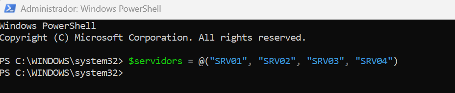

Mostra tot el contingut de l'array.
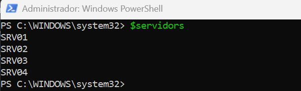

## 2. Accedir a posicions

Amb l'array anterior, mostra:

- el primer servidor;
- el segon servidor;
- el quart servidor.

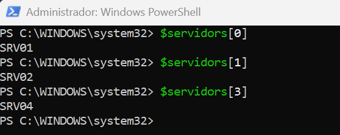

Respon:

**Quina és la posició del primer element d'un array?**
La posició del primer element d'un array és 0.

## 3. Comptar elements

Utilitza:

```powershell
.Count
```

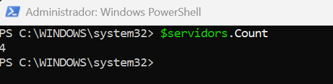

per saber quants servidors hi ha dins de l'array.

Afegeix:

```
SRV05
```

i torna a comprovar el nombre d'elements.
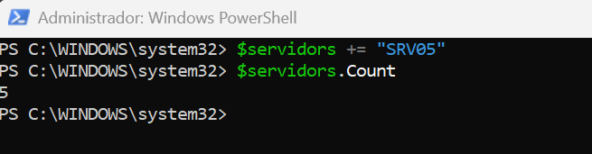

## 4. Modificar un element

Partint de:

```powershell
$servidors = "SRV01", "SRV02", "SRV03"
```

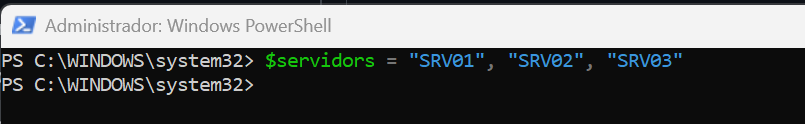

modifica el segon element perquè passi a ser:

```text
SRV-WEB01
```

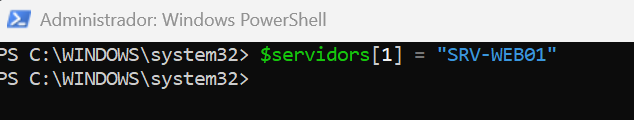

Mostra després tot l'array.
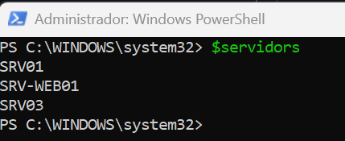

## 5. Array de ports

Crea un array numèric amb els següents ports: 22, 80, 443 i 3389
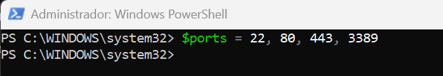

Respon (i digues quina comanda has executat per obtenir la resposta):

- Quants ports hi ha? 4 Ports
  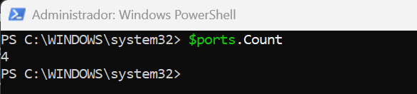
- Quin és el primer? 22
  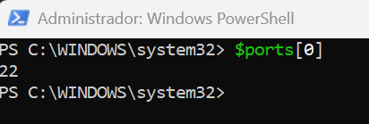
- Quin és l'últim? 3389
  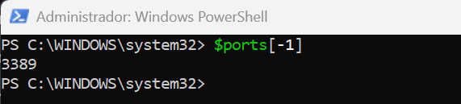
- Quin tipus té el primer element? Int32
  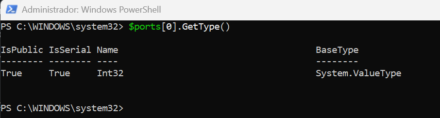

## 6. Array i variables

Crea:

```powershell
$servidor1 = "SRV01"
$servidor2 = "SRV02"
$servidor3 = "SRV03"
```

Després crea un array a partir d'aquestes variables:

Mostra'n el contingut.

## 7. Resultats d'un cmdlet

Utilitza un array per a determinar el número de processos que s'estan executant en el sistema.

## 8. General

Crea un array:

```powershell
$servidors = "SRV-DC01", "SRV-DNS01", "SRV-WEB01", "SRV-FILES01"
```

Sense tornar a escriure els noms dels servidors manualment, mostra una sortida semblant a:

```text
Primer servidor: SRV-DC01
Últim servidor: SRV-FILES01
Nombre de servidors: 4
```
