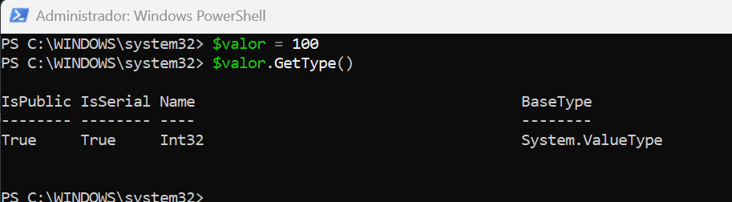
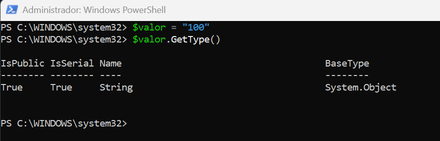
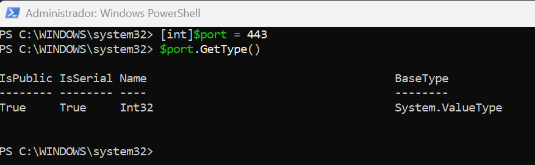
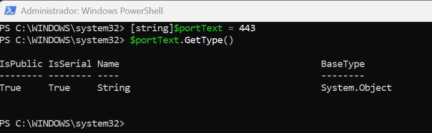
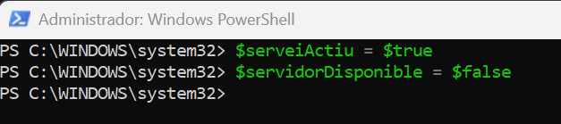
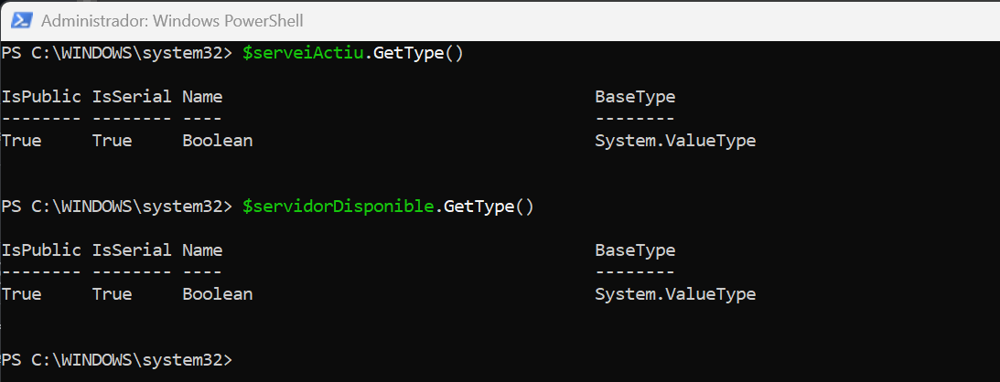
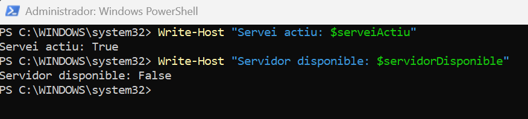
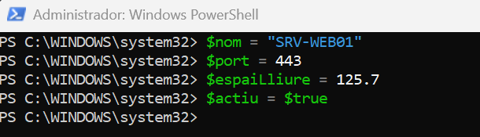
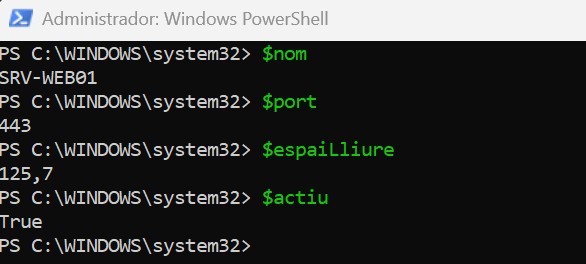
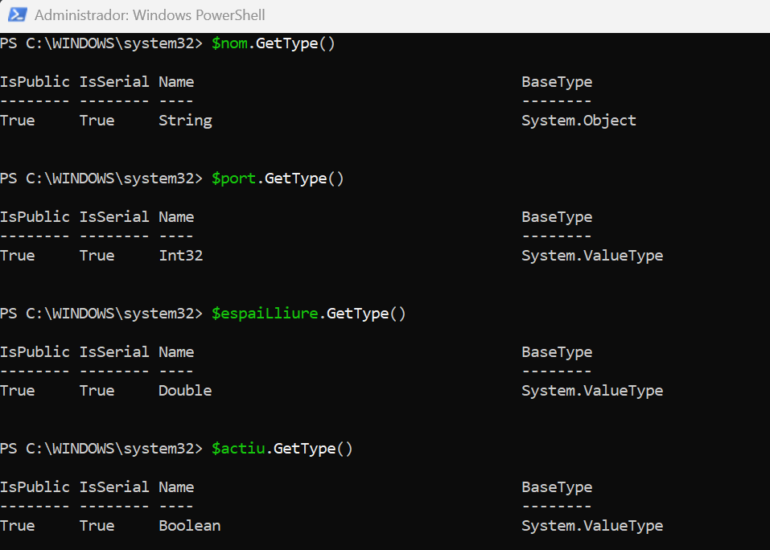

> **Nota**: Els exercicis/pràctiques t'han de servir per a familiarizar-te amb el llenguatge Powershell. Aprofita per a realitzar diverses proves i veure què passa. Documenta també aquestes proves i resultats.

# Tipus de dades

## 1. Identificar tipus

Crea les variables següents:

```powershell
$nom = "Servidor01"
$port = 443
$actiu = $true
$espai = 12.5
```


Consulta el tipus de cadascuna amb:

```powershell
.GetType()
```


Completa una taula com aquesta:

| Variable | Valor        | Tipus   |
| -------- | ------------ | ------- |
| $nom     | `Servidor01` | string  |
| $port    | `443`        | Int32   |
| $actiu   | $true        | Boolean |
| $espai   | `12.5`       | Double  |

## 2. Número o text?

Executa:

```powershell
$a = 10
$b = 5

$a + $b
```


Després:

```powershell
$a = "10"
$b = "5"

$a + $b
```


Respon:

- Quin resultat obtens en cada cas? 15 en el primer i 105 en el segon.
- Per què no és el mateix? Perquè en el primer ho guarda com a número (Int32) i el segon ho guarda com a text (string).
  Mostra després el contingut de cadascuna de les variables.

- Quin tipus tenen $a i $b en cada cas?
  Primer cas:
  

  Segon cas:
  

## 3. Canviar el tipus d'una variable

Executa:

```powershell
$valor = 100
```

Consulta:

```powershell
$valor.GetType()
```



Ara executa:

```powershell
$valor = "100"
```

i torna a consultar:

```powershell
$valor.GetType()
```



Respon:

**Ha canviat el valor? Ha canviat el tipus?**
El valor és el mateix però ha canviat el tipus el primer era Int32 i el segon string.

## 4. Tipus explícits

Executa:

```powershell
[int]$port = 443
```

Comprova el tipus:

```powershell
$port.GetType()
```



Ara prova:

```
[string]$portText = 443
```

Consulta també:

```powershell
$portText.GetType()
```



Respon:

**Tot i que visualment els dos valors semblen `443`, són del mateix tipus?**
No ja que un és Int32 i l'altra és string.

## 5. Booleans

Crea:

```powershell
$serveiActiu = $true
$servidorDisponible = $false
```


Consulta els tipus.



Després mostra un missatge amb:

```
Write-Host "Servei actiu: $serveiActiu"
Write-Host "Servidor disponible: $servidorDisponible"
```



## 6. General

Crea variables per representar un servidor amb aquesta informació:



```
Nom: SRV-WEB01
Port: 443
Espai lliure: 125.7 GB
Actiu: True
```



Després:

1. mostra el valor de totes les variables;
2. consulta el tipus de cadascuna;
3. indica quin tipus de dada has utilitzat per cada valor.
