> **Nota**: Els exercicis/pràctiques t'han de servir per a familiarizar-te amb el llenguatge Powershell. Aprofita per a realitzar diverses proves i veure què passa. Documenta també aquestes proves i resultats.

# Treballar amb variables

## 1. Crear variables

Crea les variables següents:

```
$nom
$servidor
$ip
$port
```

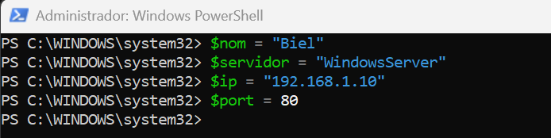

Assigna-hi valors.

Per exemple:

```
$nom = "Pere"
```

Mostra després el contingut de cadascuna de les variables.

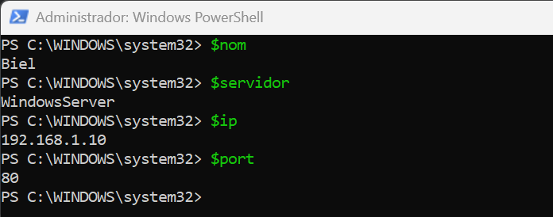

## 2. Modificar una variable

Crea:

```
$servidor = "SRV01"
```

Mostra el seu valor.

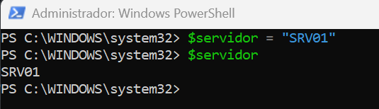

Després canvia'l per:

```
SRV02
```

Comprova quin valor conserva la variable.

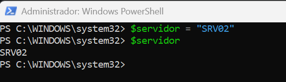

## 3. Operacions

Crea dues variables:

```
$num1 = 20
$num2 = 5
```

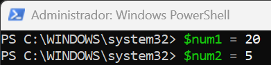

Crea una tercera variable que guardi:

- la suma;
- la resta;
- la multiplicació;
- la divisió.

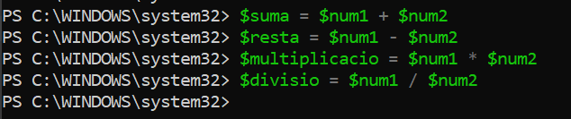

Per exemple:

```
$resultat = $num1 + $num2
```

Mostra cada resultat.

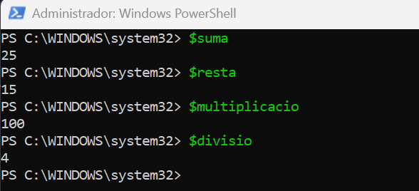

## 4. Variables dins d'un text

Crea:

```
$nom = "Anna"
$servidor = "SRV01"
```

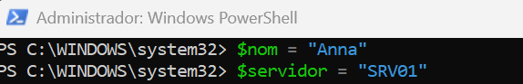

Intenta obtenir aquesta sortida:

```
L'usuari Anna està treballant amb el servidor SRV01
```

utilitzant les variables dins del text.

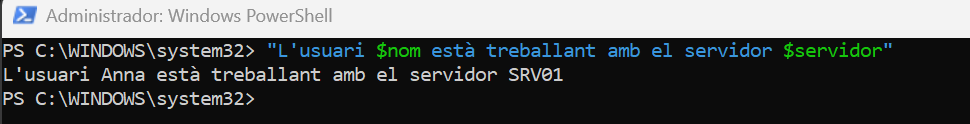

## 5. Cometes

Executa:

```
$servidor = "SRV01"
```

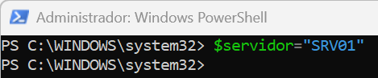

Després:

```
Write-Host "Servidor: $servidor"
```

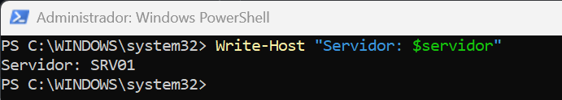

i:

```
Write-Host 'Servidor: $servidor'
```

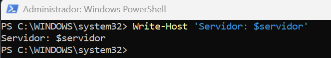

Respon:

**Quina diferència observes? Per què creus que passa?**

Observo que amb les cometes dobles PowerShell interpreta la variable i mostra el seu valor. Amb les cometes simples, PowerShell mostra el text exactament tal com està escrit.

## 6. Guardar el resultat d'una ordre

Executa:

```
$serveis = Get-Service

```

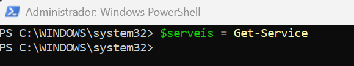

Després:

```

$serveis

```

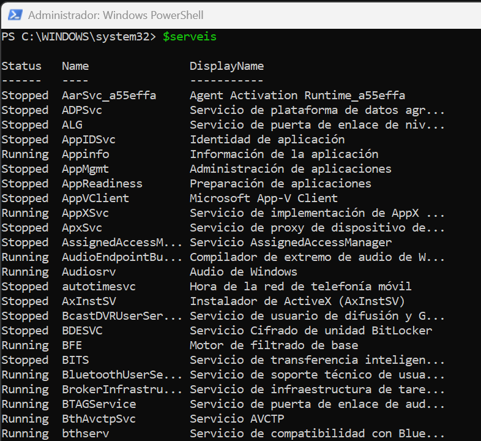

Respon:

- Què creus que conté $serveis? Conté la informació de tots els serveis de Windows.
- La variable conté un únic valor o diversos elements? Conté diversos elements, un per cada servei.

Fes el mateix amb:

```

$processos = Get-Process

```

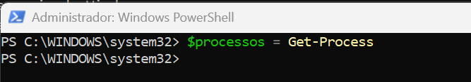

i comprova el seu contingut.

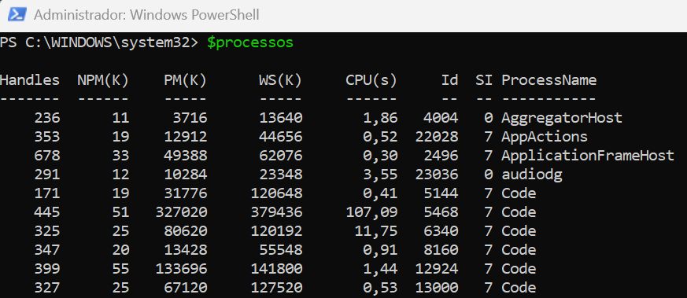

## 7. Aplicació a administració

Crea una variable:

```

$nomServei = "Spooler"

```

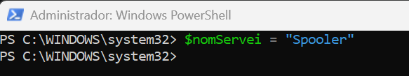

Utilitza aquesta variable per consultar el servei amb:

```

Get-Service -Name ...

```

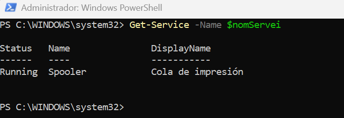

L'objectiu és obtenir el mateix resultat que:

```

Get-Service -Name Spooler

```

però **sense escriure `Spooler` directament en el cmdlet**.

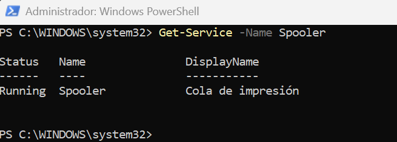
